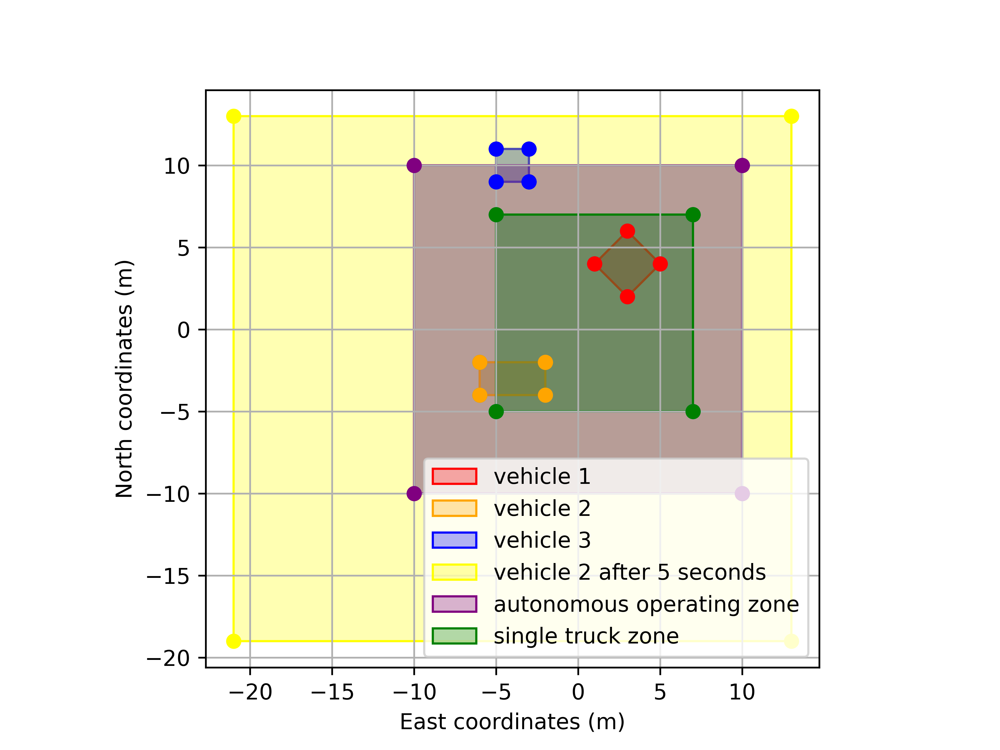

# zone-occupancy

This repository implements a solution to the following prompt related to assessing the safety of autonomous vehicles operating within predefined zones, possibly containing other vehicles. Note that the main script is in `scripts/main.py` and the core functions are in `zone_occupancy/zone_occupancy.py`.

```
# Background

Manned vehicles are tracked around our autonomous trucks using gps.
Manned vehicles report their position and size to the mineserver, which passes their location information to autonomous trucks.
The mineserver uses this data to determine occupancy of the autonomous operating zone (areas where autonomous vehicles are able to be engaged)
and single truck zones (areas where only one autonomous vehicle may be present at a time, such as where the road narrows to a single lane).
Autonomous trucks use this data to find if their stop buffers are intersecting with any other vehicles.

# Problem Statement

This problem covers zone occupancy.
Zones are given in a geojson file called zone.geojson. In this file, each zone type is recorded in the zone feature properties. This file contains an autonomous operating zone and a single truck zone. Coordinates are given in meters, in ENU.
There are several vehicles. Each vehicle's bounds are given here as an array of points. Feel free to hardcode them in your solution.
Vehicle 1:
[[1, 4], [3, 6], [5, 4], [3, 2]]
Vehicle 2:
[[-2, -2], [-6, -2], [-6, -4], [-2, -4]]
Vehicle 3:
[[-3, 9], [-3, 11], [-5, 11], [-5, 9]]

For each vehicle, submit answers to the following:
1. Is the vehicle contained in the autonomous operating zone?
2. Is any part of the vehicle intersecting the single truck zone?
3. Is any part of the vehicle intersecting the single truck zone that is already occupied by another vehicle?

Finally, in the event of a comms loss, the vehicle bounds are buffered out in every direction from its last known position at a rate of 3 m/s.
If vehicle 2 has been missing for 5 seconds, are any vehicle buffers intersecting?

Include code for the following functions in whatever structure you please, along with any test code:
0. Import and parse a geojson file.
1. Take in a zone and vehicle. Return True if the vehicle is in the zone.
2. Take in a zone and a vehicle. Return True if the vehicle is intersecting the zone.
3. Take in a zone, a list of vehicles, and a target vehicle. Return True if the target vehicle is intersecting the zone and another vehicle is also intersecting the zone.
4. Take in a list of vehicles (which includes their positions and gps data ages). Return True if any vehicle buffers intersect.

Structure the code (zone and vehicle structures, etc) as you please. Feel free to import helpful packages and ask any questions that come to mind.
```

## Installation

To clone the repo locally and install the `zone-occupancy` package, please run the following commands. Setting up within a virtual environment is recommended. Functionality was confirmed in Python 3.11.

```
git clone https://github.com/twtoner/zone-occupancy.git
cd zone-occupancy
pip3 install .
pip3 install -r requirements.txt
```


## Run main script

To run the main script, containing the answers to the prompts, run the following command.

```
python3 scripts/main.py
```

The script produces the following output.
```
Is the vehicle contained in the autonomous operating zone?
Vehicle 1 contained in autonomous operating zone: True
Vehicle 2 contained in autonomous operating zone: True
Vehicle 3 contained in autonomous operating zone: False

Is any part of the vehicle intersecting the single truck zone?
Vehicle 1 is intersecting the single truck zone: True
Vehicle 2 is intersecting the single truck zone: True
Vehicle 3 is intersecting the single truck zone: False

Is any part of the vehicle intersecting the single truck zone that is already occupied by another vehicle?
Vehicle 1 is intersecting the single truck zone while it is already occuped by another vehicle: True
Vehicle 2 is intersecting the single truck zone while it is already occuped by another vehicle: True
Vehicle 3 is intersecting the single truck zone while it is already occuped by another vehicle: False

If vehicle 2 has been missing for 5 seconds, are any vehicle buffers intersecting?
Vehicle buffers intersect without communication loss: False
Vehicle buffers intersect after a 5 second communication loss of vehicle 2: True
```


## Testing

Tests contained in `tests/test_zone_occupancy.py` can be run with the following command from the base folder.

```
python3 -m unittest discover
```

# Design notes

## Repository structure

```
zone-occupancy/
|-- zone_occupancy/
|   |-- __init__.py
|   |-- zone_occupancy.py        # core module with Vehicle, Zone, and necessary functions
|-- tests/
|   |-- __init__.py
|   |-- test_zone_occupancy.py   # tests for zone_occupancy.py functionalities
|   |-- empty.txt
|-- README.md                    # Description of the package, installation instructions, etc.
|   |-- zone_empty.json
|-- data/
|   |-- zone.json                # GeoJSON and other data files used by the package
|-- examples/
|   |-- main.py                  # Example scripts that use your package
|-- setup.py                     # Setup script for installing the package
|-- requirements.txt             # Required external packages
```


## Library selection
To parse `zone.json`, [`geojson`](https://pypi.org/project/geojson/)was used. For our simple use case, the standard `json` module would have been sufficient, but `geojson` is specifically designed for GeoJSON files and enables functionality such as checking the validity of data structures. It may also be useful for future development. 

The core computational functionality of `zone-occupancy` is polygon collision checking. Although it could be written from scratch, [`shapely`](https://pypi.org/project/shapely/) provides bindings to the GEOS C/C++ library for fast and reliable implementations of common operations like collision checking. The library was also originally designed for GIS data and can interface directly with GeoJSON files, which may be useful if our module is extended. 


## Communication delay handling
Currently, the Vehicle class has a simple setter function `set_update_age` to set the time since the last GPS update. In reality, it would likely be more practical to keep up with the last GPS timestamp and evaluate the delay on demand by comparing the last timestep to the current time. 

## Buffer expansion
We use `shapely`'s buit-in `Polygon.buffer()` method and configure it to expand the boundary polygon's edges by the buffer distance in a direction normal to the edges. An alternative implementation might expand the vertices by the buffer distance outwards with respect to the polygon's centroid, which would be slightly larger for a polygon. 

